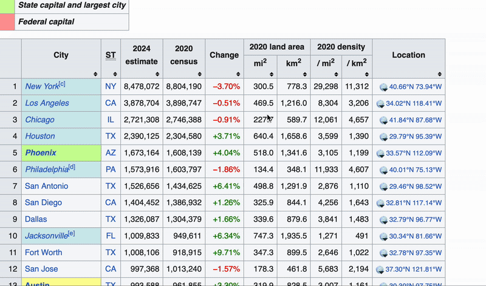

_Fun, interactive data manipulation in your terminal_

Sweet is a powerful and fun terminal-based data manipulation tool that transforms how you work with tabular data. With its intuitive interface and real-time feedback, you can quickly explore, transform, and manipulate data while automatically generating reproducible Python/Polars code.

Whether you're a data scientist, data engineer, or analyst, Sweet helps you bridge the gap between spreadsheet-like exploration and code-based data workflows.

## See Sweet in Action

### Loading Data and Making Changes


### Modifying Rows and Columns


### Working with Column Types and Saving


### Polars Data Manipulation


### Copy-Paste from Web Sources


## Getting Started in 30 Seconds

```python
# Launch Sweet from the command line
sweet

# Or load data directly
sweet --file data.csv

# Or pipe data in
echo "data.csv" | sweet
cat data.csv | sweet
```

Once in Sweet's interactive interface:

1. Load your data using the file browser or paste tabular data directly
2. Write Polars expressions with syntax highlighting: `df = df.filter(pl.col("age") > 25)`
3. See results instantly in the data preview
4. Track your transformation history for reproducible workflows

## Why Choose Sweet?

- **Interactive terminal interface**: Modern TUI with syntax highlighting and real-time feedback
- **Intuitive navigation**: Use keyboard shortcuts or mouse/pointer interactions for seamless control
- **Reproducible workflows**: Track transformation history for repeatable data exploration
- **Flexible data loading**: Files, stdin piping, or paste data directly from spreadsheets/web tables
- **Multiple export formats**: Save your transformed data as CSV, TSV, Parquet, JSON, or JSONL
- **Fast operations**: Built on Polars for high-performance data processing
- **Accessible**: Perfect for both small datasets and quick exploration tasks

## Real-World Example

```bash
# Start with a CSV file
sweet --file sales_data.csv

# In Sweet's interface, build transformations step by step:
# 1. Filter recent sales
df = df.filter(pl.col("date") > pl.date(2024, 1, 1))

# 2. Calculate revenue
df = df.with_columns((pl.col("price") * pl.col("quantity")).alias("revenue"))

# 3. Group by category
df = df.group_by("category").agg([
    pl.col("revenue").sum().alias("total_revenue"),
    pl.col("quantity").sum().alias("total_quantity")
])

# See results immediately in the data preview
```

Sweet tracks your transformation history, making it easy to understand and reproduce your data exploration workflow. The interactive interface lets you experiment with different approaches and see results instantly.

## Installation

You can install Sweet by cloning the repository and installing in development mode:

```bash
# Clone the repository
git clone https://github.com/rich-iannone/sweet-data.git
cd sweet-data

# Install in development mode
pip install -e ".[dev]"
```

Once published to PyPI, you'll be able to install with:

```bash
# Install from PyPI (coming soon)
pip install sweet-data
```

## Usage

```bash
# Launch the interactive application
sweet

# Load a specific data file
sweet --file data.csv

# Pipe filename as a string (note the echo command)
echo "data.csv" | sweet

# Or pipe file content directly
cat data.csv | sweet
```

## Features That Set Sweet Apart

- **Complete exploration workflow**: From data loading to transformation to results visualization in a single interface
- **Built for experimentation**: Interactive environment perfect for data exploration and hypothesis testing
- **Practical outputs**: Get exactly what you need: transformed data, clear results, and transformation tracking
- **Flexible deployment**: Use for quick exploration or as a foundation for building data workflows
- **Modern interface**: Terminal-based UI with syntax highlighting, keyboard shortcuts, and mouse support for intuitive navigation
- **No vendor lock-in**: Uses standard Polars expressions that work in any Python environment

## Technical Details

Sweet is built on modern Python libraries for optimal performance and developer experience:

- **Textual**: Provides the modern terminal UI framework for interactive components
- **Polars**: High-performance DataFrame library for fast data operations
- **Rich**: Terminal formatting and beautiful display components
- **Click**: Command-line interface for seamless CLI integration

The application architecture separates data models from UI components, making it extensible and maintainable.

## Contributing to Sweet

There are many ways to contribute to the ongoing development of Sweet. Some contributions can be simple (like fixing typos, improving documentation, filing issues for feature requests or problems, etc.) and others might take more time and care (like answering questions and submitting PRs with code changes). Just know that anything you can do to help would be very much appreciated!

## Roadmap

We're actively working on enhancing Sweet with:

1. **Automatic code generation**: Export transformation history as clean Python/Polars scripts
2. Additional data format support (Excel, JSON, Arrow, etc.)
3. Advanced transformation templates and snippets
4. Integration with cloud data sources
5. Export to multiple formats and destinations
6. Enhanced branching and workflow management
7. LLM-powered transformation suggestions

If you have any ideas for features or improvements, don't hesitate to share them with us! We are always looking for ways to make Sweet better.

## Code of Conduct

Please note that the sweet-data project is released with a [contributor code of conduct](https://www.contributor-covenant.org/version/2/1/code_of_conduct/). <br>By participating in this project you agree to abide by its terms.

## 📄 License

sweet-data is licensed under the MIT license.

© sweet-data authors

## 🏛️ Governance

This project is primarily maintained by
[Rich Iannone](https://bsky.app/profile/richmeister.bsky.social). Other authors may occasionally
assist with some of these duties.
